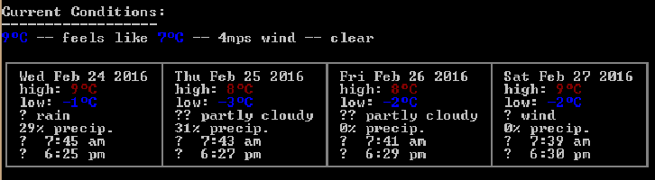

Cli-Weather !
===================


Introduction
-------------
A simple client to get weather in your terminal.  Instead of looking up the weather online, just run weather from your terminal and get instant, accurate location-based weather (current and 4-day forecast ! ).


 Before begin
--------------------------
**1.**  Fork the project on https://github.com/92bondstreet/rdd-cdd-tdd

**2.** Clone the project git clone git@github.com:YOUR_USERNAME/rdd-cdd-tdd.git

> **Note : Some installations are required**

> - Install node js
> ``` npm install node.js ```
> - Install the packages of the project
	> Place yourself in the directory weather 
	``` npm install ```


